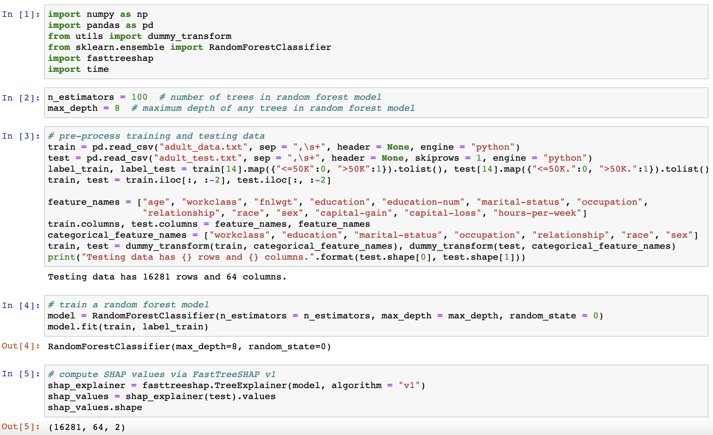
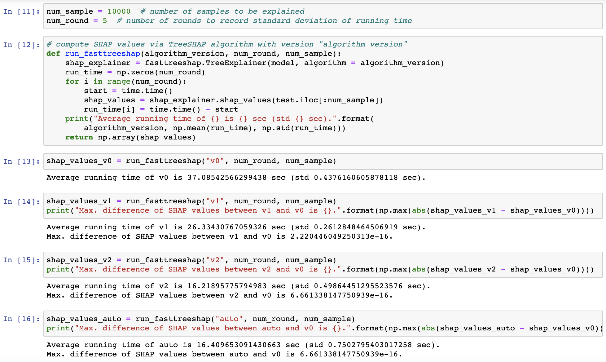

# FastTreeSHAP

[](https://pypi.org/project/fasttreeshap)
[](https://pepy.tech/project/fasttreeshap)

FastTreeSHAP package is built based on the paper [Fast TreeSHAP: Accelerating SHAP Value Computation for Trees](https://arxiv.org/abs/2109.09847) published in [NeurIPS 2021 XAI4Debugging Workshop](https://xai4debugging.github.io/). It is a fast implementation of the [TreeSHAP](https://arxiv.org/abs/1802.03888) algorithm in the [SHAP](https://github.com/slundberg/shap) package.

For more detailed introduction of FastTreeSHAP package, please check out this [blogpost](https://engineering.linkedin.com/blog/2022/fasttreeshap--accelerating-shap-value-computation-for-trees).

## Introduction

[SHAP](https://arxiv.org/abs/1705.07874) (SHapley Additive exPlanation) values are one of the leading tools for interpreting machine learning models. Even though computing SHAP values takes exponential time in general, TreeSHAP takes polynomial time on tree-based models (e.g., decision trees, random forest, gradient boosted trees). While the speedup is significant, TreeSHAP can still dominate the computation time of industry-level machine learning solutions on datasets with millions or more entries.

In FastTreeSHAP package we implement two new algorithms, FastTreeSHAP v1 and FastTreeSHAP v2, designed to improve the computational efficiency of TreeSHAP for large datasets. We empirically find that Fast TreeSHAP v1 is **1.5x** faster than TreeSHAP while keeping the memory cost unchanged, and Fast TreeSHAP v2 is **2.5x** faster than TreeSHAP, at the cost of a slightly higher memory usage (performance is measured on a single core).

The table below summarizes the time and space complexities of each variant of TreeSHAP algorithm ( is the number of samples to be explained,  is the number of features,  is the number of trees,  is the maximum number of leaves in any tree, and  is the maximum depth of any tree). Note that the (theoretical) average running time of FastTreeSHAP v1 is reduced to 25% of TreeSHAP.
|TreeSHAP Version|Time Complexity|Space Complexity|
|:---------------|--------------:|---------------:|
|TreeSHAP|||
|FastTreeSHAP v1|||
|FastTreeSHAP v2 (general case)|||
|FastTreeSHAP v2 (balanced trees)|||

## Performance with Parallel Computing

Parallel computing is fully enabled in FastTreeSHAP package. As a comparison, parallel computing is not enabled in [SHAP](https://github.com/slundberg/shap) package except for "shortcut" which calls TreeSHAP algorithms embedded in [XGBoost](https://github.com/dmlc/xgboost), [LightGBM](https://github.com/microsoft/LightGBM), and [CatBoost](https://github.com/catboost/catboost) packages specifically for these three models.

The table below compares the execution times of FastTreeSHAP v1 and FastTreeSHAP v2 in FastTreeSHAP package against TreeSHAP algorithm (or "shortcut") in [SHAP](https://github.com/slundberg/shap) package on two datasets [Adult](https://archive.ics.uci.edu/ml/datasets/census+income) (binary classification) and [Superconductor](https://archive.ics.uci.edu/ml/datasets/superconductivty+data) (regression). All the evaluations were run in parallel on all available cores in Azure Virtual Machine with size Standard_D8_v3 (8 cores and 32GB memory) (except for [scikit-learn](https://scikit-learn.org) models in [SHAP](https://github.com/slundberg/shap) package). We ran each evaluation on 10,000 samples, and the results were averaged over 3 runs.
|Model|# Trees|Tree<br>Depth|Dataset|SHAP (s)|FastTree- <br>SHAP v1 (s)|Speedup|FastTree- <br>SHAP v2 (s)|Speedup|
|:----|------:|---------:|------:|-------:|---------------------:|------:|---------------------:|------:|
|sklearn random forest|500|8|Adult|318.44\*|43.89|**7.26**|27.06|**11.77**|
|sklearn random forest|500|8|Super|466.04|58.28|**8.00**|36.56|**12.75**|
|sklearn random forest|500|12|Adult|2446.12|293.75|**8.33**|158.93|**15.39**|
|sklearn random forest|500|12|Super|5282.52|585.85|**9.02**|370.09|**14.27**|
|XGBoost|500|8|Adult|17.35\*\*|12.31|**1.41**|6.53|**2.66**|
|XGBoost|500|8|Super|35.31|21.09|**1.67**|13.00|**2.72**|
|XGBoost|500|12|Adult|62.19|40.31|**1.54**|21.34|**2.91**|
|XGBoost|500|12|Super|152.23|82.46|**1.85**|51.47|**2.96**|
|LightGBM|500|8|Adult|7.64\*\*\*|7.20|**1.06**|3.24|**2.36**|
|LightGBM|500|8|Super|8.73|7.11|**1.23**|3.58|**2.44**|
|LightGBM|500|12|Adult|9.95|7.96|**1.25**|4.02|**2.48**|
|LightGBM|500|12|Super|14.02|11.14|**1.26**|4.81|**2.91**|

\* Parallel computing is not enabled in SHAP package for scikit-learn models, thus TreeSHAP algorithm runs on a single core.\
\*\* SHAP package calls TreeSHAP algorithm in XGBoost package, which by default enables parallel computing on all cores.\
\*\*\* SHAP package calls TreeSHAP algorithm in LightGBM package, which by default enables parallel computing on all cores.

## Installation

FastTreeSHAP package is available on PyPI and can be installed with pip:

```sh
pip install fasttreeshap
```

Installation troubleshooting:
* On Macbook, if an error message `ld: library not found for -lomp` pops up, run the following command line before installation ([Reference](https://iscinumpy.gitlab.io/post/omp-on-high-sierra)):
```sh
brew install libomp
```

## Usage

The following screenshot shows a typical use case of FastTreeSHAP on [Census Income Data](https://archive.ics.uci.edu/ml/datasets/census+income). Note that the usage of FastTreeSHAP is exactly the same as the usage of [SHAP](https://github.com/slundberg/shap), except for four additional arguments in the class `TreeExplainer`: `algorithm`, `n_jobs`, `memory_tolerance`, and `shortcut`.

`algorithm`: This argument specifies the TreeSHAP algorithm used to run FastTreeSHAP. It can take values `"v0"`, `"v1"`, `"v2"` or `"auto"`, and its default value is `"auto"`:
* `"v0"`: Original TreeSHAP algorithm in [SHAP](https://github.com/slundberg/shap) package.
* `"v1"`: FastTreeSHAP v1 algorithm proposed in [FastTreeSHAP](https://arxiv.org/abs/2109.09847) paper.
* `"v2"`: FastTreeSHAP v2 algorithm proposed in [FastTreeSHAP](https://arxiv.org/abs/2109.09847) paper.
* `"auto"` (default): Automatic selection between `"v0"`, `"v1"` and `"v2"` according to the number of samples to be explained and the constraint on the allocated memory. Specifically, `"v1"` is always preferred to `"v0"` in any use cases, and `"v2"` is preferred to `"v1"` when the number of samples to be explained is sufficiently large (2^{D+1}/D"/>), and the memory constraint is also satisfied (,  is the number of threads). More detailed discussion of the above criteria can be found in [FastTreeSHAP](https://arxiv.org/abs/2109.09847) paper and in Section [Notes](#notes).

`n_jobs`: This argument specifies the number of parallel threads used to run FastTreeSHAP. It can take values `-1` or a positive integer. Its default value is `-1`, which means utilizing all available cores in parallel computing.

`memory_tolerance`: This argument specifies the upper limit of memory allocation (in GB) to run FastTreeSHAP v2. It can take values `-1` or a positive number. Its default value is `-1`, which means allocating a maximum of 0.25 * total memory of the machine to run FastTreeSHAP v2.

`shortcut`: This argument determines whether to use the TreeSHAP algorithm embedded in [XGBoost](https://github.com/dmlc/xgboost), [LightGBM](https://github.com/microsoft/LightGBM), and [CatBoost](https://github.com/catboost/catboost) packages directly when computing SHAP values for XGBoost, LightGBM, and CatBoost models and when computing SHAP interaction values for XGBoost models. Its default value is `False`, which means bypassing the "shortcut" and using the code in FastTreeSHAP package directly to compute SHAP values for XGBoost, LightGBM, and CatBoost models. Note that currently `shortcut` is automaticaly set to be True for CatBoost model, as we are working on CatBoost component in FastTreeSHAP package. More details of the usage of "shortcut" can be found in the notebooks [Census Income](notebooks/FastTreeSHAP_Census_Income.ipynb), [Superconductor](notebooks/FastTreeSHAP_Superconductor.ipynb), and [Crop Mapping](notebooks/FastTreeSHAP_Crop_Mapping.ipynb).



The code in the following screenshot was run on all available cores in a Macbook Pro (2.4 GHz 8-Core Intel Core i9 and 32GB Memory). We see that both `"v1"` and `"v2"` produce exactly the same SHAP value results as `"v0"`. Meanwhile, `"v2"` has the shortest execution time, followed by `"v1"`, and then `"v0"`. `"auto"` selects `"v2"` as the most appropriate algorithm in this use case as desired. For more detailed comparisons between FastTreeSHAP v1, FastTreeSHAP v2 and the original TreeSHAP, check the notebooks [Census Income](notebooks/FastTreeSHAP_Census_Income.ipynb), [Superconductor](notebooks/FastTreeSHAP_Superconductor.ipynb), and [Crop Mapping](notebooks/FastTreeSHAP_Crop_Mapping.ipynb).



## Notes

* In [FastTreeSHAP](https://arxiv.org/abs/2109.09847) paper, two scenarios in model interpretation use cases have been discussed: one-time usage (explaining all samples for once), and multi-time usage (having a stable model in the backend and receiving new scoring data to be explained on a regular basis). Current version of FastTreeSHAP package only supports one-time usage scenario, and we are working on extending it to multi-time usage scenario with parallel computing. Evaluation results in [FastTreeSHAP](https://arxiv.org/abs/2109.09847) paper shows that FastTreeSHAP v2 can achieve as high as 3x faster explanation in multi-time usage scenario.
* The implementation of parallel computing is straightforward for FastTreeSHAP v1 and the original TreeSHAP, where a parallel for-loop is built over all samples. The implementation of parallel computing for FastTreeSHAP v2 is slightly more complicated: Two versions of parallel computing have been implemented. Version 1 builds a parallel for-loop over all trees, which requires  memory allocation (each thread has its own matrices to store both SHAP values and pre-computed values). Version 2 builds two consecutive parallel for-loops over all trees and over all samples respectively, which requires  memory allocation (first parallel for-loop stores pre-computed values across all trees). In FastTreeSHAP package, version 1 is selected for FastTreeSHAP v2 as long as its memory constraint is satisfied. If not, version 2 is selected as an alternative as long as its memory constraint is satisfied. If the memory constraints in both version 1 and version 2 are not satisfied, FastTreeSHAP v1 will replace FastTreeSHAP v2 with a less strict memory constraint.

## Notebooks

The notebooks below contain more detailed comparisons between FastTreeSHAP v1, FastTreeSHAP v2 and the original TreeSHAP in classification and regression problems using [scikit-learn](https://scikit-learn.org), [XGBoost](https://github.com/dmlc/xgboost) and [LightGBM](https://github.com/microsoft/LightGBM):
* [Census Income (Binary Classification)](notebooks/FastTreeSHAP_Census_Income.ipynb)
* [Superconductor (Regression)](notebooks/FastTreeSHAP_Superconductor.ipynb)
* [Crop Mapping (Multiclass Classification)](notebooks/FastTreeSHAP_Crop_Mapping.ipynb)

## Citation
Please cite [FastTreeSHAP](https://arxiv.org/abs/2109.09847) in your publications if it helps your research:
```
@article{yang2021fast,
  title={Fast TreeSHAP: Accelerating SHAP Value Computation for Trees},
  author={Yang, Jilei},
  journal={arXiv preprint arXiv:2109.09847},
  year={2021}
}
```

## License
Copyright (c) LinkedIn Corporation. All rights reserved. Licensed under the [BSD 2-Clause](https://opensource.org/licenses/BSD-2-Clause) License.
